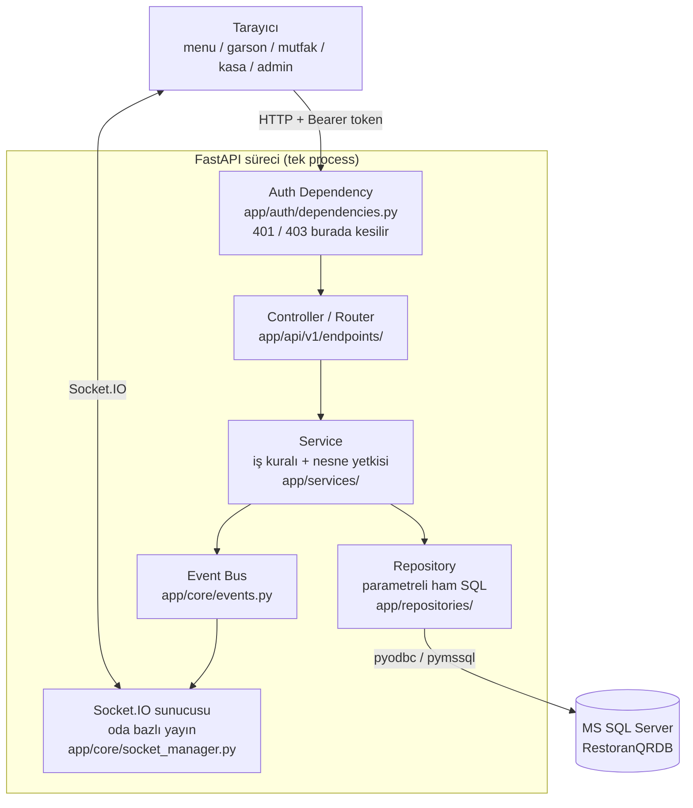
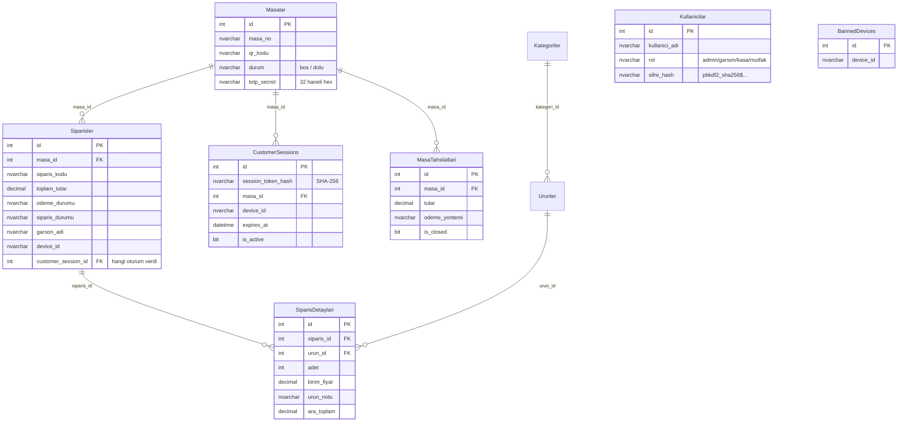
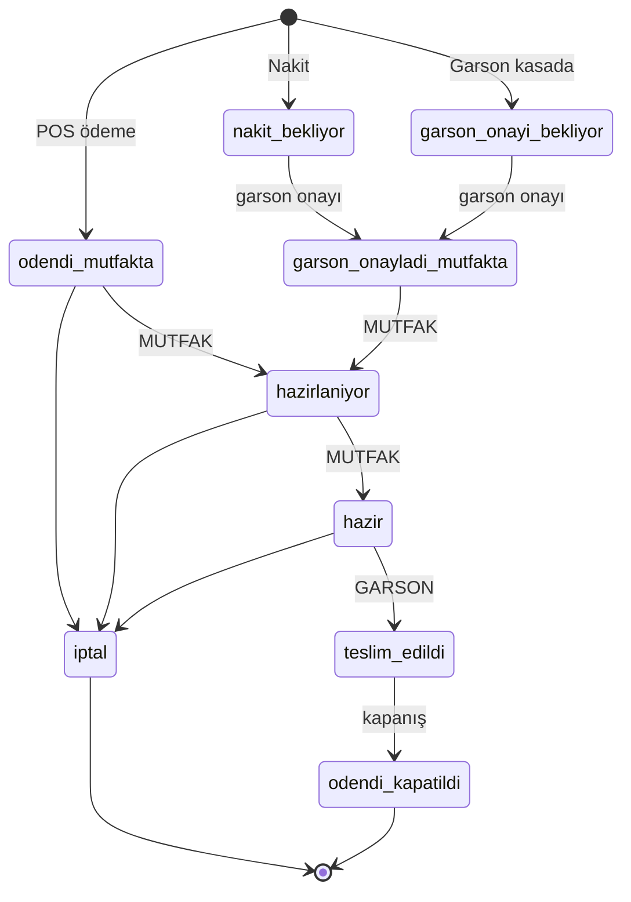
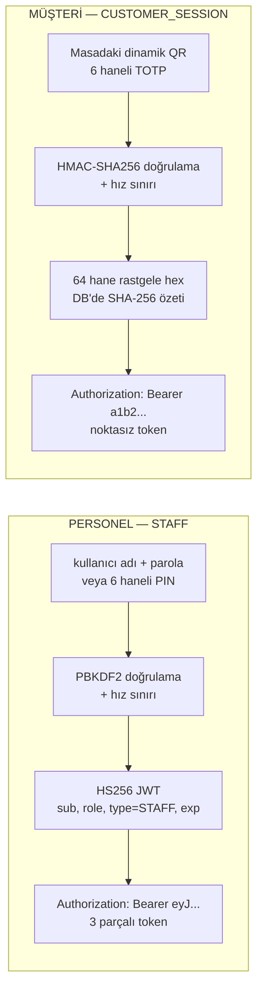
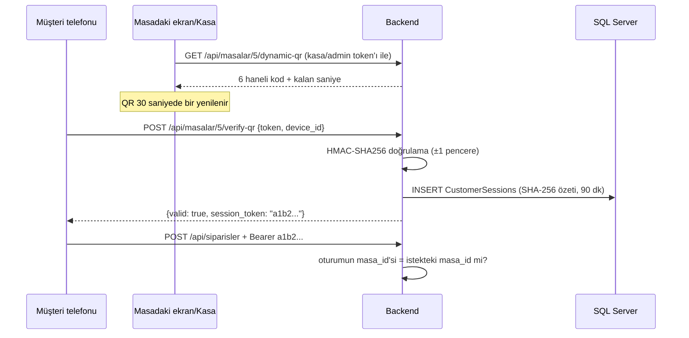
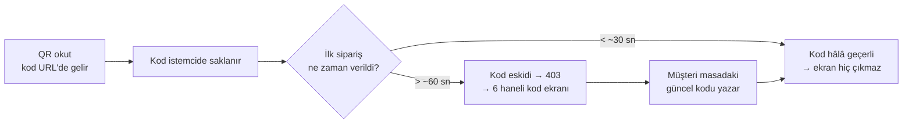
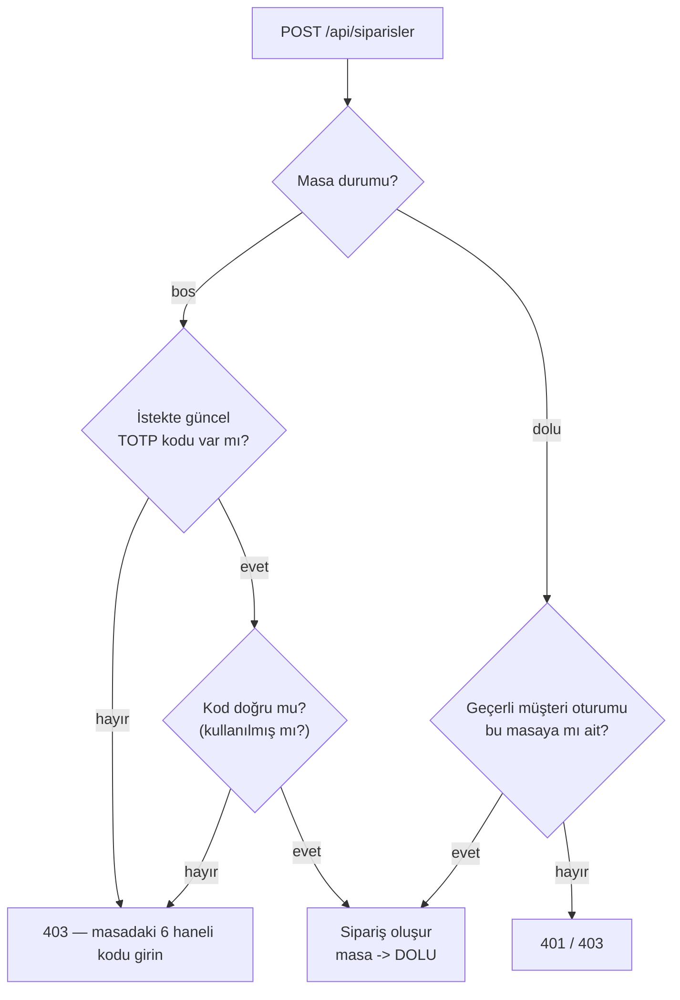
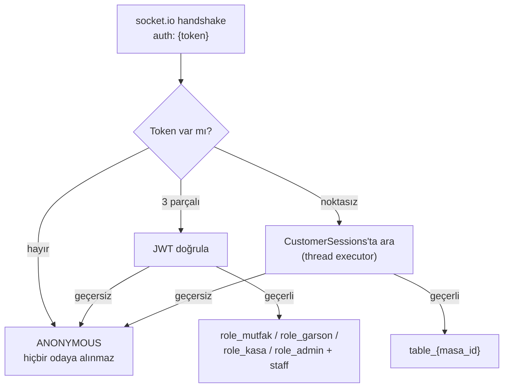
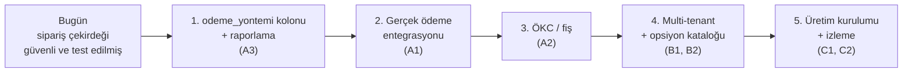

# QR Kodlu Restoran Sipariş ve Operasyon Sistemi
## Mimari ve Teknoloji Sunum Dokümanı

> Bu doküman projeyi **sunumda anlatabilmek** için hazırlanmıştır: sistem ne yapıyor,
> hangi teknoloji neden seçildi, istek nereden nereye akıyor, güvenlik nerede
> uygulanıyor. Buradaki her teknik iddia mevcut kod, canlı veritabanı şeması veya
> çalıştırılmış testler üzerinden doğrulanmıştır.
>
> Doğrulama tarihi: 2026-08-17 · Branch: `dev` · Son commit: `1757f3e`

---

## 1. Yönetici Özeti

Restoranda masaya oturan müşteri, masadaki ekranda dönen **dinamik QR kodu**
telefonuyla okutur; menüyü açar, sepetini oluşturur ve ödeme yöntemini seçerek
sipariş verir. Sipariş, ödeme yöntemine göre ya doğrudan **mutfağa** düşer ya da
önce **garson/kasa onayı** bekler. Mutfak "hazırlanıyor → hazır", garson "teslim
edildi" der; müşteri bu değişiklikleri sayfayı yenilemeden canlı görür. Kasa
masanın adisyonunu yönetir, parçalı tahsilat alır ve masayı kapatır.

Rakamlarla mevcut sistem (canlı veritabanından okundu):

| | |
|---|---|
| Masa | 41 |
| Kategori / Ürün | 9 / 63 |
| Kayıtlı sipariş / sipariş kalemi | 180 / 178 |
| Personel hesabı | 8 (3 rol + admin) |
| HTTP endpoint | 34 operasyon (22'si kimlik doğrulama zorunlu) |
| Otomatik test | 198 Python + 45 Node = **243 test, tamamı geçiyor** |
| Backend kod | ~3.900 satır Python |

**Projenin ayırt edici tarafı**, klasik bir CRUD menü uygulaması olmamasıdır:
para, stok ve fiziksel masa sahipliği söz konusu olduğu için sistem baştan
"frontend bir güvenlik sınırı değildir" varsayımıyla tasarlanmıştır. Fiyat,
toplam tutar, masa kimliği ve sipariş durumu istemciden **hiçbir zaman** olduğu
gibi kabul edilmez.

---

## 2. Aktörler ve Ekranlar

| Aktör | Ekran | Kimlik doğrulama | Ne yapar |
|---|---|---|---|
| Müşteri | `/menu?masa=5&token=123456` | QR/TOTP → müşteri oturum token'ı | Menü, sepet, sipariş, canlı sipariş takibi |
| Garson | `/garson` | 6 haneli PIN → JWT | Nakit tahsilat onayı, teslim, masa taşıma/kapatma, cihaz yasaklama |
| Mutfak | `/mutfak` | kullanıcı adı/parola → JWT | Hazırlanıyor / hazır durum geçişleri |
| Kasa | `/kasa` | kullanıcı adı/parola → JWT | Adisyon, parçalı tahsilat, masa kapatma, QR ekranı |
| Admin | `/admin` | kullanıcı adı/parola → JWT | Kategori/ürün/masa CRUD |

> Sayfaların HTML'i herkese açıktır; **koruma sayfada değil, sayfanın çağırdığı
> API'dedir.** Bu bilinçli bir tercihtir: giriş ekranını gizlemek güvenlik
> sağlamaz, API'yi korumak sağlar.

---

## 3. Teknoloji Seçimleri ve Gerekçeleri

Bu bölüm sunumun en çok soru gelen kısmıdır: **"neden bunu seçtin?"**

### 3.1 Backend: FastAPI (0.139) + Uvicorn

**Neden:**
- **Async ASGI**: WebSocket ve HTTP aynı süreçte, aynı port üzerinde çalışabiliyor.
  Sipariş verildiği anda mutfak ekranına push göndermek için ayrı bir servis
  gerekmiyor.
- **Dependency Injection**: Kimlik doğrulama tek bir yerde yazılıp
  `Depends(require_roles(UserRole.ADMIN))` şeklinde her endpoint'e takılabiliyor.
  Bu, "her controller içine token kontrolü kopyala-yapıştır" hatasını yapısal
  olarak engelliyor.
- **Pydantic ile otomatik doğrulama**: `adet` alanının pozitif tam sayı olması
  gerektiğini bir kez model üzerinde yazıyoruz, tüm uçlar için geçerli oluyor.
- **Otomatik OpenAPI**: `/docs` üzerinden tüm uçlar ve hangi ucun token
  istediği makine tarafından okunabilir şekilde yayınlanıyor. Güvenlik denetimi
  bunun üzerinden otomatikleştirilebiliyor (bkz. §12).

**Alternatifler neden seçilmedi:**
- *Flask*: async WebSocket ve DI desteği için ek kütüphane yığını gerekirdi.
- *Django*: ORM + admin + auth paketi hazır gelir; ancak veritabanı **zaten
  mevcut ve şema dışarıdan yönetiliyor**, Django'nun migration/ORM modeli bu
  şemaya adapte etmek yarardan çok yük getirirdi.
- *Node/Express*: takımın Python bilgisi ve MSSQL sürücü olgunluğu nedeniyle
  tercih edilmedi.

### 3.2 Veritabanı: Microsoft SQL Server + ham SQL (ORM yok)

**Neden:**
- Veritabanı projeye **hazır şemayla** geldi (`Masalar`, `Siparisler`,
  `SiparisDetaylari`, `Urunler`, `Kategoriler`, `Kullanicilar`). ORM eklemek,
  var olan şemayı model sınıflarına ters mühendislikle uydurmak demekti.
- Sipariş/stok akışında **atomiklik** kritik. Ham SQL ile
  `UPDATE Urunler SET stok = stok - ? WHERE id = ? AND stok >= ?` gibi tek
  ifadelik, yarış koşulundan (race condition) etkilenmeyen sorgular yazmak
  ORM üzerinden yazmaktan hem daha açık hem daha güvenilir.
- Tüm sorgular **parametreli** (`?` placeholder). Bu, SQL injection'a karşı
  temel savunma. Denetimde tek bir dinamik kolon adı bulundu, o da servis
  katmanının sabit anahtar kümesinden geliyor.

**Bedeli:** repository katmanını elle yazmak gerekti (`app/repositories/`).
Kabul edilen bir maliyet; karşılığında sorgu davranışı tamamen görünür.

**Sürücü stratejisi:** Önce `pyodbc` (ODBC Driver 18/17), bulunamazsa `pymssql`
denenir; başarılı bağlantı parametresi önbelleğe alınır. Amaç: farklı geliştirme
makinelerinde kurulum sürtünmesini azaltmak.

### 3.3 Gerçek zamanlı: Socket.IO (python-socketio 5.16)

**Neden ham WebSocket değil:**
- Otomatik yeniden bağlanma, kalp atışı (heartbeat) ve **polling fallback**
  hazır geliyor. Restoranda telefonlar mobil veri ↔ Wi-Fi arasında geçiş
  yapıyor; bağlantı kopmaları normal.
- **Room (oda) kavramı hazır**: `role_mutfak`, `role_garson`, `table_5` gibi
  mantıksal kanallara yayın yapmak, ham WebSocket'te elle yazılacak bir
  abonelik altyapısını bedavaya getiriyor. Yetki izolasyonu bunun üzerine
  kuruldu (bkz. §10).

### 3.4 Kimlik doğrulama: elle yazılmış HS256 JWT + PBKDF2

**Neden hazır kütüphane (`python-jose`, `passlib`, `bcrypt`) değil:**
- Proje "gereksiz bağımlılık ekleme" kuralıyla yürütülüyor. JWT'nin ihtiyaç
  duyulan kısmı (HMAC-SHA256 imzalama/doğrulama) Python standart
  kütüphanesindeki `hmac` + `hashlib` + `base64` ile ~230 satırda,
  **fazladan bağımlılık olmadan** karşılanabiliyor.
- Parola özeti için `hashlib.pbkdf2_hmac` standart kütüphanede mevcut
  (600.000 iterasyon, 16 bayt tuz, 32 bayt özet).

**Bunun riski açıkça kabul edilmiştir:** kendi kripto kodunu yazmak genelde
önerilmez. Bu yüzden implementasyon **kasıtlı olarak dar** tutuldu — yalnızca
`alg: HS256` kabul edilir, `alg: none` veya algoritma değiştirme saldırısı
yapısal olarak imkânsızdır, ve token profili (`typ` + `aud`) token tipiyle
çapraz doğrulanır. Üretime çıkarken standart bir kütüphaneye geçiş makul bir
sonraki adımdır.

### 3.5 Frontend: bağımlılıksız (vanilla) JavaScript

**Neden React/Vue yok:**
- Uygulama beş bağımsız sayfadan oluşuyor; ortak durum (state) paylaşımı yok.
- Müşteri tarafı **telefonda, restoran Wi-Fi'ında, tek seferlik** açılıyor.
  200-300 KB'lık bir framework indirmesi, ilk açılış süresini doğrudan kötüleştirir.
- Build adımı (npm, webpack, bundler) yok → deploy = dosyayı kopyala.

**Bedeli:** `app.js` ve `kasa.js` 1.800 satır civarında. Bu, projenin
kabul ettiği en büyük teknik borç kalemi.

### 3.6 Bilinçli olarak EKLENMEYENLER

| Teknoloji | Neden eklenmedi |
|---|---|
| **Redis** | Oturumlar zaten SQL Server'da (`CustomerSessions`). Tek backend süreci için ikinci bir veri deposu işletme yükü getirir, güvenlik kazancı sıfırdır. |
| **RabbitMQ / Kafka** | Ayrıntılı gerekçe §11'de. Özet: mesaj kuyruğu servisler *arası* dayanıklı iletişim içindir; burada tek servis ve tarayıcıya anlık bildirim ihtiyacı var. |
| **ORM (SQLAlchemy)** | §3.2. |
| **pytest** | Testler standart kütüphane `unittest` ile yazıldı; sıfır ek bağımlılık. |

---

## 4. Katmanlı Mimari ve İstek Akışı



**Kritik tasarım kuralı:** Yetki kontrolü **iki katmanda** yapılır.

1. **Route seviyesi** (dependency): "Bu kişi kim ve rolü ne?" → yanlışsa 401/403,
   controller kodu hiç çalışmaz.
2. **Servis seviyesi**: "Bu kişi *bu nesne* üzerinde *bu işlemi* yapabilir mi?"
   Örneğin geçerli bir mutfak token'ı vardır ama `teslim_edildi` yapmaya
   çalışıyordur → `enforce_order_status_role` 403 döner.

İkinci katman neden gerekli? Çünkü route seviyesi sadece "rol listesi"
bilir; siparişin **hangi durumda olduğunu** ve o role **hangi geçişin** izinli
olduğunu bilmez. Ayrıca servisler ileride başka bir controller'dan veya bir
arka plan görevinden de çağrılabilir.

### Dizin haritası

```
app/
├─ main.py                  FastAPI + Socket.IO ASGI birleşimi, CORS, statik dosyalar
├─ database.py              Bağlantı yönetimi + db_transaction() context manager
├─ enums/domain.py          UserRole, OrderStatus, PaymentStatus, TableStatus, TokenType
├─ auth/
│  ├─ tokens.py             HS256 JWT üret/doğrula (iss, aud, exp, type)
│  ├─ passwords.py          PBKDF2-SHA256 hash/verify
│  ├─ rate_limit.py         Süreç-içi deneme sınırlayıcı
│  ├─ models.py             StaffPrincipal, TokenClaims (frozen dataclass)
│  └─ dependencies.py       get_current_staff / require_roles / müşteri oturumu
├─ api/
│  ├─ views.py              HTML sayfa rotaları
│  └─ v1/endpoints/         auth, admin, garson, masalar, siparisler, urunler, kategoriler
├─ services/                iş kuralları (siparis, masa, auth, kategori, urun)
│  └─ order_authorization.py  rol→durum matrisi + durum geçiş makinesi
├─ repositories/            ham SQL
└─ core/
   ├─ socket_manager.py     Socket.IO handshake, odalar, olay yayını
   ├─ events.py             Servis → Socket bağımlılığını kesen olay veri yolu
   └─ totp_service.py       Dinamik QR kodu üret/doğrula
```

**`core/events.py` neden var?** Servis katmanının doğrudan Socket.IO'yu import
etmesi, iş mantığını taşıma teknolojisine bağlardı. Event bus araya girerek
servisi "olay yayınlayan" bir bileşene indirger; yarın Socket.IO yerine SSE
gelse servis kodu değişmez.

---

## 5. Veri Modeli



Sunumda vurgulanacak iki tasarım kararı:

1. **`CustomerSessions.session_token_hash`** — token'ın kendisi değil,
   SHA-256 özeti saklanır. Veritabanı okunsa bile canlı oturum token'ları ele
   geçirilemez. Aynı mantık personel parolalarında da geçerli
   (`sifre_hash` = PBKDF2, canlı veritabanında **8/8 kullanıcı** için doğrulandı).
2. **`MasaTahsilatlari`** — kasadan alınan parçalı ödemeler önceden yalnızca
   tarayıcı belleğindeydi; sayfa yenilenince kayboluyordu. Kalıcı tabloya
   taşındı, masa kapanınca `is_closed = 1` ile arşivlenir.

**Bilinen şema eksiği:** `Siparisler` tablosunda `odeme_yontemi` kolonu yok.
Değer yalnızca sipariş oluşturma cevabında ve canlı olayda taşınır; veritabanından
geri okunduğunda kaybolur. Bu bilinçli olarak açık bırakıldı çünkü şema
değişikliği kullanıcı onayı gerektiriyor.

---

## 6. Sipariş Yaşam Döngüsü

### 6.1 Ödeme yöntemine göre başlangıç durumu

| Ödeme yöntemi | `odeme_durumu` | `siparis_durumu` | Sonuç |
|---|---|---|---|
| `pos` (dijital) | `odendi` | `odendi_mutfakta` | Doğrudan mutfağa düşer |
| `nakit` | `bekliyor` | `nakit_bekliyor` | Garson masadan tahsil edene kadar mutfağa **düşmez** |
| `garson_kasada` | `bekliyor` | `garson_onayi_bekliyor` | Garson onayı bekler |

Buradaki iş kuralı nettir: **ödeme kanıtlanmadan mutfak çalışmaya başlamaz.**

### 6.2 Durum makinesi



Bu geçiş haritası `app/services/order_authorization.py` içinde **veri olarak**
tutulur. İki güvenlik özelliği vardır:

- **Terminal durum koruması:** `iptal` ve `odendi_kapatildi` durumundaki bir
  sipariş hiçbir şekilde değiştirilemez (HTTP 400).
- **Fail-closed:** Haritada tanımsız bir durum gelirse geçiş **reddedilir**
  (HTTP 409). Önceki sürümde tanımsız durum tüm kontrolü atlıyordu; tek bir
  eşleşmeyen değer durum makinesinin tamamını devre dışı bırakabiliyordu.

### 6.3 Rol → izinli hedef durum matrisi

| Rol | Yapabildiği durum geçişleri |
|---|---|
| `mutfak` | `hazirlaniyor`, `hazir` |
| `garson` | `garson_onayladi_mutfakta`, `nakit_tahsil_edildi`, `teslim_edildi` |
| `kasa` | `nakit_tahsil_edildi` |
| `admin` | tümü |

Mutfak `teslim_edildi` diyemez, garson `hazirlaniyor` diyemez. **Ekranda o buton
olmadığı için değil, backend 403 döndüğü için.**

---

## 7. Kimlik Doğrulama Mimarisi

Sistemde **iki ayrı kimlik türü** vardır ve bunlar kasıtlı olarak birbirinin
yerine geçemez.



### 7.1 Personel: JWT nasıl çalışıyor?

Token üç parçadan oluşur: `header.payload.signature` (base64url).

```json
// payload
{ "sub": "7", "role": "admin", "type": "STAFF",
  "iat": 1755400000, "exp": 1757992000,
  "iss": "qr-restoran-api", "aud": "qr-restoran-staff" }
```

**İmza ne sağlıyor?** Sunucu, `header.payload` metnini gizli anahtarla
(`AUTH_SECRET_KEY`) HMAC-SHA256'dan geçirir ve sonucu token'daki imzayla
`hmac.compare_digest` ile karşılaştırır. Kullanıcı payload'daki `role` alanını
`garson`'dan `admin`'e çevirirse imza tutmaz → 401. **Yani token'ın içindekine
güvenmemizin sebebi içeriği gizli olması değil, değiştirilemez olmasıdır.**
(JWT payload'ı herkesçe okunabilir; bu yüzden içine sır konmaz.)

Doğrulamada kontrol edilenler:
`alg == HS256` · imza · `iss` · `aud` · `typ` başlığı · `exp` (süre) ·
`iat` gelecekte mi · `type == STAFF` · `sub` pozitif tam sayı ·
**ve son olarak veritabanındaki güncel rol ile token'daki rolün eşleşmesi**
(bir kullanıcının rolü düşürüldüğünde eski token'ı otomatik geçersiz kılar).

**Neden veritabanına da bakıyoruz?** JWT stateless'tır; iptal edilemez.
Her istekte `Kullanicilar` tablosundan tek satır okuyup rolü karşılaştırmak,
"silinmiş/rolü değişmiş personel" senaryosuna karşı ucuz bir çözüm.

**Parola saklama:** `pbkdf2_sha256$600000$<tuz>$<özet>`. Tuz her kullanıcı için
farklı (rainbow table'ı etkisiz kılar), 600.000 iterasyon kaba kuvveti
pahalılaştırır. Kullanıcı bulunamasa bile bir **kukla hash** doğrulanır — böylece
"var olmayan kullanıcı" ile "yanlış parola" arasındaki cevap süresi farkından
kullanıcı adı çıkarılamaz (timing attack koruması).

**Hız sınırı:** IP + hesap bazlı, 5 başarısız deneme / 5 dakika → HTTP 429.
Başarılı giriş yalnızca **hesap** sayacını sıfırlar, IP sayacını değil; aksi
halde bilinen tek bir şifreyle sayaç sıfırlanıp diğer hesaplara saldırılabilirdi.

### 7.2 Müşteri: QR → TOTP → oturum



**TOTP nasıl çalışıyor?** Her masanın veritabanında 32 haneli gizli anahtarı var
(`Masalar.totp_secret`). Kod = `HMAC-SHA256(secret, unix_zaman / 30)` sonucunun
6 haneye indirgenmiş hali. Yani kod **zamana bağlıdır ve masaya özeldir**;
sunucu ile ekran aynı anahtardan aynı kodu bağımsız olarak üretir, kod hiçbir
zaman ağ üzerinden dağıtılmaz.

- **Tolerans:** mevcut pencere **± 1** (`TOTP_WINDOW_TOLERANCE`). Bir kod
  okutulduktan sonra **30-59 saniye** yaşar; aradaki fark, QR'ın 30 saniyelik
  pencerenin neresinde okutulduğuna bağlıdır.
- **Replay koruması:** doğrulanan `(masa, kod, pencere)` üçlüsü işaretlenir,
  ikinci kez kullanılamaz.
- **Kaba kuvvet koruması:** 6 hane + aynı anda 3 geçerli pencere = teorik olarak
  kırılabilir bir alan. Bu yüzden `/verify-qr` ucu IP + masa bazlı
  **10 başarısız deneme / 60 saniye** sınırına tabidir → HTTP 429.

**Oturum token'ı:** `secrets.token_hex(32)` (256 bit entropi, tahmin edilemez),
veritabanında yalnızca SHA-256 özeti, 90 dakika ömür, `is_active` ile iptal
edilebilir, `masa_id`'ye bağlı.

### 7.2.1 "Neden bazen kod soruyor, bazen sormuyor?"

Demoda kesin sorulacak soru. Cevap: **hiç sormaması normal, sorması da normal.**

QR'ı okuttuğunda adres `/menu?masa=5&token=123456` şeklinde gelir. İstemci bu
kodu saklar ([app.js](../static/js/app.js)) ve **ilk siparişte otomatik olarak**
isteğe ekler. Yani kodu müşteri yazmaz, QR taşır.



Belirleyici olan **masa durumu veya ödeme yöntemi değil**, QR'ı okutmakla
siparişi vermek arasında geçen süredir:

| Süre | Davranış |
|---|---|
| 30 saniyeden az | Kod sorulmaz |
| 30-59 saniye | Kodun pencerenin neresinde üretildiğine göre değişir |
| 60 saniyeden fazla | Kod sorulur |

Güvenlik açısından fark yok: kod her iki durumda da sunucuda doğrulanır, sadece
elle yazılmak yerine otomatik taşınır. Kanıtın "tazeliği" tolerans kadardır —
bu yüzden tolerans **±2'den ±1'e indirildi**: fiziksel varlık kanıtı artık en
fazla 59 saniye eski olabiliyor (önceden 89 saniyeye kadar çıkabiliyordu).

### 7.3 İki token tipini ayırma

- Personel token'ı **3 parçalı JWT**, müşteri token'ı **noktasız hex**.
  `get_current_user_or_customer` ayrımı nokta sayısına bakarak yapar.
- JWT içindeki `type` alanı ve `aud` değeri de tip başına farklıdır. Müşteri
  tipli bir JWT üretilse bile personel çözücüsü `WrongTokenTypeError` ile
  reddeder (test: `test_06_customer_session_token_rejected_on_staff_decoder`).
- Müşteri token'ı ile admin ucuna gidilirse: `get_current_staff` 401 verir.

### 7.4 401 mi 403 mü?

| Durum | Cevap |
|---|---|
| Token yok / bozuk / süresi dolmuş / yanlış tip | **401 Unauthorized** |
| Token geçerli ama rol yetkisiz | **403 Forbidden** |
| Token geçerli ama başka masanın verisi isteniyor | **403 Forbidden** |

Bu ayrım `AGENTS.md §11`'de kural olarak yazılıdır ve testlerle doğrulanır.

---

## 8. Kritik İş Kuralı: BOŞ → DOLU "Troll Siparişi" Koruması

Bu, projenin en özgün güvenlik kuralıdır ve sunumda mutlaka anlatılmalıdır.

**Saldırı senaryosu:** Kötü niyetli biri restorana girer, boş bir masanın QR'ını
okutur, çıkar gider. Bir saat sonra masaya gerçek müşteriler oturur. Eski
kullanıcı evinden o masaya 20 tabak sipariş geçer.

**Çözüm:** Masa `bos` durumundayken verilen **ilk sipariş**, o anda geçerli olan
6 haneli TOTP kodunu ister. Kod 30 saniyede bir değiştiği için, kodu bilmek
"şu anda fiziksel olarak masadasın" anlamına gelir.



**Masa DOLU olduktan sonra ne oluyor?** Masaya sonradan katılan arkadaşlar QR
okutup oturum alır; her siparişte tekrar kod istenmez. İş kuralı şudur:

> **Boş masayı ilk siparişle sahiplenen kişi, o anda masada olduğunu kanıtlamak
> zorundadır.** Sonradan katılanlar için masa zaten doğrulanmış bir gruba aittir.

### 8.1 Adisyon sınırı: iki grubu birbirinden ayıran şey

Sistemde ayrı bir "adisyon" tablosu yok. Bir grubun hesabını sonraki gruptan
ayıran tek olay, **masanın `bos` durumuna dönmesi.** Bu iki yolla olur:

1. Kasa/garson "Masayı Temizle" der
2. Her şey teslim edilip ödendiğinde masa **kendiliğinden** boşalır

İkisi de aynı kapanış rutinini çalıştırır (`_close_masa_session`):

- siparişler kapatılır (`odendi_kapatildi`)
- tahsilatlar arşivlenir
- **o masanın tüm müşteri oturumları iptal edilir**
- masa taşıma yönlendirmeleri temizlenir

Neden ikisi de? Çünkü kalabalık serviste garson masayı toplamaya hemen gelemez.
Masa açık kalırsa oraya oturan yeni müşteri, önceki grubun adisyonuna bağlanır —
tam olarak engellemek istediğimiz sonuç. Otomatik boşalma bu yüzden korunmuştur.

> Önceden yalnızca kasa yolu oturumları iptal ediyordu. Kendiliğinden boşalmada
> önceki müşterinin token'ı ömrü bitene kadar yaşıyordu; sonraki grup masayı
> kodla sahiplendiği anda o eski token onların hesabına sipariş ekleyebiliyordu.
> Bu, §8'deki troll senaryosunun bir masa devri gecikmesiyle geri gelmiş hâliydi.

### 8.2 Aynı masada birden fazla kişi

| Kim | Ne yapar |
|---|---|
| Masayı ilk sahiplenen | QR okutur **ve** 6 haneli kodu yazar |
| Sonradan katılanlar | Sadece QR okutur |

Sonradan katılanlardan ayrıca kod istenmez çünkü **QR zaten kodu taşır** —
karekod 30 saniyede bir yenilenir ve `verify-qr` içindeki kodu doğrular. Yani
"QR okutmak" ile "kodu elle yazmak" aynı kanıtı üretir: *şu anda bu masadayım*.

Adisyon ortak, sepetler ayrıdır. Herkes kendi telefonunda sepet yapar, hepsi
aynı hesaba düşer.

### 8.3 Oturum ömrü kayan penceredir

Müşteri oturumu 90 dakikalıktır ama **her kullanımda yeniden 90 dakikaya
uzatılır** (en fazla 15 dakikada bir yazma yapılır). Sonuç:

- Masada oturup sipariş vermeye devam eden müşterinin oturumu hiç bitmez
- Kalkıp giden birinin oturumu, son işleminden sonra kendi kendine söner

Sabit ömürde bu ikisi ayırt edilemiyordu.

---

## 9. İstemciden Gelen Veriye Güvenmeme

Bu bölüm "kod sadece çalışsın" ile "üretime çıkabilir" arasındaki farkı anlatır.

| İstemcinin gönderdiği | Backend ne yapıyor |
|---|---|
| `birim_fiyat` | **Yok sayılır.** Fiyat `Urunler.fiyat` üzerinden yeniden hesaplanır. |
| `toplam_tutar` | **Yok sayılır.** Satır toplamlarının sunucu tarafı toplamı yazılır. |
| `masa_id` | Müşteri oturumundaki `masa_id` ile karşılaştırılır, uyuşmazsa 403. |
| `garson_adi` | **Şemadan tamamen kaldırıldı.** Denetim adı doğrulanmış token'dan alınır. |
| `siparis_durumu` | Yalnızca rol matrisi + durum makinesinin izin verdiği değer kabul edilir. |
| `device_id` | Yasaklı cihaz kontrolü için kullanılır; yetki kanıtı sayılmaz (§13'te açık madde). |
| `adet` | Pydantic: `> 0`. Negatif adetle stok artırma yolu kapalı. |

Ek olarak sipariş oluşturmada:
- **Pasif ürün kontrolü**: `aktif_mi = 0` olan ürün sipariş edilemez (400).
- **Stok kontrolü**: yetersiz stok → 400 (eskiden sessizce sıfıra kırpılıyordu).
- **Atomik stok düşümü**: `WHERE id = ? AND stok_miktari >= ?` — iki telefon
  aynı anda son ürünü sipariş ederse yalnızca biri stoktan düşebilir.
- **Idempotency**: aynı (masa, cihaz, sepet) 5 saniye içinde tekrar gelirse
  önceki cevap döner — çift tıklama iki sipariş oluşturmaz.

Personel sipariş düzenleme (`PUT /siparisler/{id}`) yolunda ise fiyat yine
sunucuda hesaplanır; ancak **iskonto/ikram** akışları taban fiyatın altına
inebildiği için "gönderilen fiyat taban fiyattan düşük" reddi bu yolda
uygulanmaz. Repository katmanı bu yolda istek modelini **hiç görmez**, yalnızca
sunucu tarafından fiyatlanmış sözlükleri kabul eder — istemci fiyatının
veritabanına ulaşacak bir yolu yoktur.

---

## 10. Gerçek Zamanlı Mimari (Socket.IO)

### 10.1 Bağlantı anında kimlik doğrulama



**En önemli nokta:** İstemcinin gönderdiği `masa_id` **oda üyeliği vermez.**
Daha önce `?masa_id=5` ile bağlanan herkes 5 numaralı masanın sipariş
kalemlerini, tutarlarını ve ödeme durumunu canlı olarak dinleyebiliyordu.
Şimdi bu değer yalnızca "bu masada biri menüye bakıyor" ipucu olarak saklanır
ve garsona bildirim düşürür; veri erişimi sağlamaz.

### 10.2 Oda tabanlı yayın

| Olay | Kimlere gider |
|---|---|
| `yeni_siparis` | tüm personel (`staff`) |
| `garson_onay_talebi`, `nakit_odeme_talebi`, `nakit_odendi` | garson + kasa + admin (**mutfak hariç**) |
| `durum_guncellendi`, `masa_durumu_degisti` | personel + ilgili `table_{id}` |
| `garson_musteri_geldi` | garson + admin |

Mutfak neden ödeme olaylarını almıyor? Çünkü ihtiyacı yok. **En az yetki
prensibi**: mutfak ekranını ele geçiren biri masanın ödeme bilgisini göremez.

### 10.3 Sunumda anlatılmaya değer bir hata hikâyesi

Milestone 7 "tamamlandı" olarak işaretlenmişti ve testleri geçiyordu. Ancak
`sio.enter_room()` python-socketio 5.16'da bir **coroutine**'dir ve kod bunu
`await` etmiyordu. Sonuç: hiçbir istemci hiçbir odaya girmiyordu, dolayısıyla
odaya yapılan her yayın **sıfır kişiye** ulaşıyordu. Panellerin canlı
güncellenmemesi bu yüzdendi.

Testler bunu neden yakalamadı? Testte `MagicMock` kullanılmıştı; `MagicMock`
çağrının `await` edilip edilmediğini umursamaz, sadece "çağrıldı" der. Düzeltme
sırasında test `AsyncMock` + `assert_awaited_once_with` ile değiştirildi.

> **Çıkarılan ders (ve projenin çalışma kuralı):** "Testi geçti" tek başına
> yeterli değildir. Test, davranış bozulduğunda **gerçekten kırmızıya
> dönmelidir.**

---

## 11. RabbitMQ / Kafka Gerekli mi? (Hayır — ve nedeni)

| Teknoloji | Ne işe yarar | Bu projede karşılığı |
|---|---|---|
| **WebSocket / Socket.IO** | Sunucu ile **tarayıcı** arasında iki yönlü canlı bağlantı. Kullanıcıya *anında* bildirim. | **Gerekli ve kullanılıyor.** Mutfak ekranının F5'siz güncellenmesi bu. |
| **RabbitMQ** | Servisler arası **dayanıklı iş kuyruğu**. Mesaj tüketilene kadar saklanır, yeniden denenir. Tüketici çökse bile iş kaybolmaz. | **Gereksiz.** Tek backend süreci var; kuyruğa koyup kendinden okumak sadece gecikme ve işletme yükü ekler. |
| **Kafka** | Yüksek hacimli **olay akışı** günlüğü; olaylar saklanır, birden fazla tüketici geçmişe dönük okuyabilir. Log/analitik/event sourcing ölçeği. | **Kesinlikle gereksiz.** Günde birkaç yüz sipariş için Kafka, tabanca yerine top kullanmaktır. |

**Kritik ayrım:** Message broker, **authentication/authorization'ın yerine
geçmez.** Broker eklemek "her istemci her olayı alıyor" problemini çözmez; bunu
çözen şey oda izolasyonu ve token doğrulamasıdır — ki uygulanan da budur.

**Peki ne zaman gerekir?** Birden fazla backend instance çalıştırıldığında.
O durumda A sunucusuna bağlı mutfak, B sunucusunda oluşan siparişi göremez.
Çözüm sırası şudur:

1. **Önce**: Socket.IO'nun kendi `AsyncRedisManager`'ı (veya eşdeğeri) ile
   instance'lar arası yayın köprüsü. Tek satırlık değişiklik.
2. **Sonra**: süreç-belleğindeki durum (masa taşıma haritası, TOTP replay
   kümesi, "menüye bakıyor" durumu) paylaşımlı depoya taşınır.
3. **Ancak** sipariş akışı gerçekten servislere bölünürse (ör. ayrı bir fatura
   servisi, entegrasyon servisi) RabbitMQ anlamlı olur.

---

## 12. Test ve Doğrulama Yaklaşımı

```bash
python -m unittest discover -s tests -v
```

```bash
node --test "tests/frontend/**/*.test.cjs"
```

- **198 Python testi** — token doğrulama (eksik/geçersiz/süresi dolmuş/yanlış
  tip), rol matrisi, durum makinesi, yetkili fiyatlandırma, stok yarışı,
  idempotency, BOŞ→DOLU fiziksel doğrulama, TOTP pencere/replay, adisyon
  kapanışı ve oturum iptali, kayan oturum ömrü, masa sahipliği (IDOR),
  Socket.IO oda izolasyonu, QR hız sınırı, repository SQL parametreleri.
- **45 Node testi** — XSS kaçış (escape) sözleşmeleri, panel script'lerinin
  token göndermesi, müşteri oturumu kurtarma akışı, native `alert/confirm`
  kullanılmaması, UI kuralları.
- **Bağımlılık yok**: `unittest` + Node yerleşik test koşucusu. `pytest` ve
  `httpx` kurulu değil; bu yüzden HTTP seviyesi testler FastAPI `TestClient`
  yerine **doğrudan ASGI arayüzü** üzerinden sürülür.

**Mutation testing.** "Test geçiyor" tek başına kanıt sayılmıyor. Kritik her
koruma için, koruma koddan geçici olarak çıkarılıp ilgili testin **gerçekten
kırmızıya döndüğü** doğrulandı. Milestone 7'de bir testin, bozuk kodu fark
edemeyen bir sahte nesneye karşı yeşil kalması bu kuralın sebebidir.

Ayrıca OpenAPI şeması denetim aracı olarak kullanılır: 34 operasyonun 22'si
`StaffBearer` güvenlik gereksinimi yayınlar; açık kalanlar bilinçli olarak
publiktir (menü, kategori, login, PIN doğrulama, QR doğrulama ve HTML sayfalar).

---

## 13. Bilinen Sınırlar ve Açık Konular

Bu bölüm **teknik** açıkları listeler. Ürünleşme/ticarileşme için gereken işler
ayrı bir konudur ve §15'te yol haritası olarak durur.

Sunumda bunları **kendiniz söylemek**, dinleyicinin bulmasından iyidir:

1. **Süreç-belleği durumu** — masa taşıma haritası (`TABLE_MOVES_MAP`), TOTP
   replay kümesi ve "menüye bakıyor" bilgisi yeniden başlatmada kaybolur ve
   birden fazla worker arasında paylaşılmaz. Kalıcılaştırmak yeni tablo
   (şema değişikliği) gerektirdiği için onaya bırakıldı.
2. **`device_id` bir taşıyıcı kimlik gibi davranıyor** — "masada zaten kayıtlı
   cihaz" yolunda TOTP olmadan oturum verilebiliyor. Kaba kuvvet artık
   sınırlandırıldı, ancak bu bir iş kuralı değişikliği olduğu için onay bekliyor.
3. **Opsiyon fiyatlandırması metin eşleşmesine dayalı** —
   `"Orta Boy" in urun_notu` gibi. Doğru çözüm fiyatların ürün kataloğunda
   tanımlanmasıdır; bu da şema değişikliğidir.
4. **`Siparisler.odeme_yontemi` kolonu yok** — ödeme yöntemi veritabanından
   geri okunamıyor.
5. **Veritabanı CHECK kısıtı yok** — rol/durum/pozitif tutar kuralları yalnızca
   uygulama katmanında. Doğrudan SQL erişimi olan biri geçersiz veri yazabilir.
6. **JWT iptal edilemez** — süresi (varsayılan 30 gün) dolana kadar geçerlidir.
   Rol değişimi anında etkilidir (DB kontrolü sayesinde) ama "token'ı iptal et"
   özelliği yoktur. Kısa ömür + refresh token bir sonraki adım olabilir.
7. **Frontend dosya boyutu** — `app.js` ve `kasa.js` ~1.800 satır; modülerleşme
   ihtiyacı var.
8. **`masa=99` geliştirici baypası** — `app.js` içinde 99 numaralı masa için
   QR doğrulaması atlanıyor. Backend bu durumda yine token istediği için
   güvenlik açığı oluşturmuyor, ancak üretime çıkmadan temizlenmelidir.
9. **Adisyon örtük bir kavram** — ayrı bir tablo yerine "masanın `bos`'a dönmesi"
   olayıyla temsil ediliyor. Çalışıyor ve her yerde aynı şekilde uygulanıyor,
   ama `MasaOturumlari` tablosu açmak bunu veritabanı garantisine dönüştürür,
   adisyon bazlı raporlamayı ve bölünmüş masayı mümkün kılar. Şema değişikliği
   gerektirdiği için sonraya bırakıldı.
10. **Adisyon açıkken masadan kalkan kişi** — oturumu, adisyon kapanana kadar
    kullanılabilir kalır. Kayan pencere bunu sınırlar; QR sipariş
    sistemlerinin kabul ettiği artık risk.
11. **Socket.IO oda üyeliği oturum iptalini aşar** — veritabanında oturum iptal
    edilse de, el sıkışma sırasında `table_{id}` odasına girmiş bir soket
    bağlantı kopana kadar o odanın olaylarını almaya devam eder. Sadece
    görüntüleme; her HTTP işlemi oturumu yeniden kontrol ettiği için işlem
    yapamaz.

---

## 14. Sunum İçin Demo Senaryosu

1. **Kasa panelinden** masa 5'in QR ekranını aç → kodun 30 saniyede bir
   değiştiğini göster.
2. **Telefondan** QR'ı okut → menü açılır. Sepete ürün ekle → **garson
   panelinde** "masa 5 menüye bakıyor / ürün seçti" bildirimi anında düşsün.
3. Nakit ile sipariş ver → **mutfak paneline düşmediğini** göster (ödeme
   kanıtlanmadı). Garson panelinde "nakit ödeme talebi" belirsin.
4. Garson tahsilatı onaylasın → sipariş **mutfağa düşsün**, müşteri ekranında
   durum canlı değişsin.
5. Mutfak "hazırlanıyor" → "hazır", garson "teslim edildi" desin.
6. **Saldırı denemesi (en etkili kısım):** DevTools/Postman ile
   ```
   POST /api/siparisler   (token olmadan)          → 401
   GET  /api/masalar/9/aktif-siparis  (masa 5 token'ı ile) → 403
   POST /api/admin/urunler (garson token'ı ile)    → 403
   birim_fiyat: 1 TL gönder                        → sunucu gerçek fiyatı yazar
   PATCH /siparisler/{id}/durum (mutfak → teslim_edildi) → 403
   ```
7. Masayı kapat → eski müşteri token'ının artık çalışmadığını göster.

---

## 15. Yol Haritası: Ürünleşme İçin Ne Gerekiyor

§13 projenin **teknik** açıklarını listeliyor. Bu bölüm farklı bir soruya cevap
veriyor: *"Bu sistemi yarın bir restorana satabilir miyiz?"*

Cevap: **henüz hayır** — ve nedenleri kod kalitesiyle ilgili değil. Bugün elde
olan şey, güvenlik modeli oturmuş, gerçek zamanlı çalışan, test edilmiş bir
**sipariş çekirdeği**. Eksik olan, o çekirdeğin etrafındaki işletme katmanı.

Aşağıdaki maddelerin hiçbiri "yapılması unutulmuş" değildir; hepsi bir staj
projesinin kapsamı dışında kalan, bilinçli olarak ertelenmiş işlerdir.

### A. Satışı doğrudan engelleyenler

| # | Eksik | Neden engelliyor |
|---|---|---|
| A1 | **Gerçek ödeme entegrasyonu yok** | İstemci `odeme_yontemi="pos"` diyor, sistem "ödendi" yazıyor. Banka/iyzico/PayTR entegrasyonu, provider callback'i ve mutabakat yok. Ürünün varlık sebebi olan para akışı bir yer tutucu. |
| A2 | **Yazarkasa (ÖKC) / fiş yok** | Türkiye'de ödeme alan bir sistemde fiş kesmek ve ÖKC entegrasyonu yasal zorunluluk. Ne fiş çıktısı ne entegrasyon var. |
| A3 | **Ciro raporlaması yok** | Restoran sahibinin ilk sorusu "bugün ne sattım?". Gün sonu/Z raporu, ürün-kategori-saat bazlı satış, garson performansı yok. Üstelik `Siparisler` tablosunda **`odeme_yontemi` kolonu bile yok**, yani "ne kadarı nakit, ne kadarı kart" sorusu veritabanından cevaplanamıyor. |

A1 ve A2 entegrasyon işi; A3 mevcut şemanın üstüne oturur ama önce `odeme_yontemi`
kolonunun eklenmesi gerekir.

### B. Ürünleşmeyi engelleyenler

| # | Eksik | Etkisi |
|---|---|---|
| B1 | **Tek restoran (single tenant)** | Şemada `restoran_id` yok. İkinci müşteriye satmak şema değişikliği gerektirir. SaaS hedefleniyorsa multi-tenant baştan tasarlanmalı. |
| B2 | **Opsiyonlar koda gömülü** | Fiyat farkları `"Orta Boy" in urun_notu` gibi Türkçe metin eşleşmesiyle hesaplanıyor. Restoran kendi opsiyonunu ekleyemez; Python dosyası düzenlemek gerekir. |
| B3 | **Dil seçimi işlevsel değil** | `selectLanguage()` seçimi kaydedip bir bildirim gösteriyor, başka hiçbir yerde okunmuyor. Menü tek dilde (`urun_adi` tek alan). Turistik bölge hedefleniyorsa bu şu an boş bir vaat. |
| B4 | **Kampanya / indirim modeli yok** | İskonto ve ikram yalnızca kasa ekranında, veri modelinde karşılığı yok. |
| B5 | **İptal/iade akışı ve denetim izi yok** | Sipariş `iptal` olabiliyor ama sebep, kimin yaptığı ve iade kaydı tutulmuyor. Kasa açığı çıktığında geriye dönük izlenemez. |

### C. İşletmeyi riske atanlar

| # | Eksik | Etkisi |
|---|---|---|
| C1 | **Üretim kurulumu yok** | `uvicorn --reload` ile, HTTP üzerinden çalışıyor; CORS localhost'a ayarlı. Reverse proxy, HTTPS, servis yöneticisi, yedekleme planı yok. |
| C2 | **Hata izleme / gözlemlenebilirlik yok** | Yapısal log, metrik, hata toplama (Sentry benzeri) yok. Akşam servisinde bir şey bozulursa **müşteriden öğrenilir**. |
| C3 | **Tek instance** | Masa taşıma haritası, TOTP replay kümesi ve "menüye bakıyor" durumu süreç belleğinde. Yeniden başlatma = kayıp; ikinci sunucu = tutarsızlık. Çözüm sırası §11'de. |

### Önerilen sıra



Raporlama en başta, çünkü en ucuz olan ve işletmeye ilk günden görünür değer
üreten madde o. Ödeme entegrasyonu ondan sonra gelir çünkü teknik olarak en
riskli ve en uzun süren iş.

### Sunumda nasıl anlatılmalı

Bu listeyi **kendin söylemek**, dinleyicinin bulmasından çok daha güçlüdür.
Önerilen çerçeve:

> "Bugün elimizde güvenlik tarafı sıkı, gerçek zamanlı çalışan ve test edilmiş
> bir sipariş çekirdeği var. Ticarileşme için sırasıyla raporlama, gerçek ödeme
> entegrasyonu, ÖKC/fiş ve multi-tenant şema gerekiyor. İlk üçü entegrasyon
> işi, dördüncüsü mevcut şemanın üstüne oturur."

Bu cümleyi kurabilmek, o özellikleri yarım yamalak yapmış olmaktan iyidir.
Kapsamı bilerek sınırlamak ve sınırın nerede olduğunu bilmek, mühendislik
olgunluğunun kendisidir.

---

## 16. Kapanış: Bu Projede Öğrenilenler

- **Güvenlik bir özellik değil, bir katmandır.** Sonradan eklenirken sekiz
  milestone sürdü; baştan tasarlansa çok daha ucuz olurdu.
- **Frontend asla güvenlik sınırı değildir.** Butonu gizlemek koruma sağlamaz.
- **Test edilmemiş özellik, eklenmemiş özelliktir** — ve yanlış yazılmış test,
  test edilmemiş özelliğin "tamamlandı" görünmesine yol açar (§10.3).
- **Teknoloji eklemek maliyetlidir.** Redis/RabbitMQ/Kafka eklemek CV'de iyi
  durur, ama gerekçesiz eklenen her bileşen işletilmesi, izlenmesi ve
  güvenliğinin sağlanması gereken yeni bir yüzeydir.
